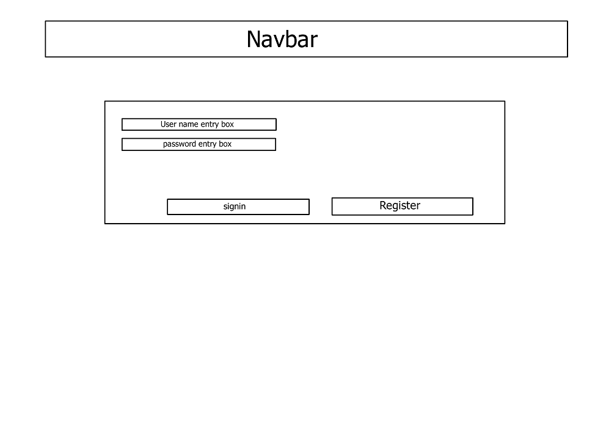

# Orchart

## An Organizing Chart system for Orchards

The purpose of Orchart is to offer farmers a charting system to effectively track the treatment of trees and other plants in orchards and fields.  This is accomplished through letting farmers enter the date and type of treatment they used per plant or field.  Orchart gives farmers the option of a more organized and modifiable digital version of paper charts.

please view the projects section for production cards

## ERD

## Current Mockups for pages

Homepage mockup

Login page mockup

Profile page mockup

Field page mockup

Plant page mockup

Treatment page mockup

